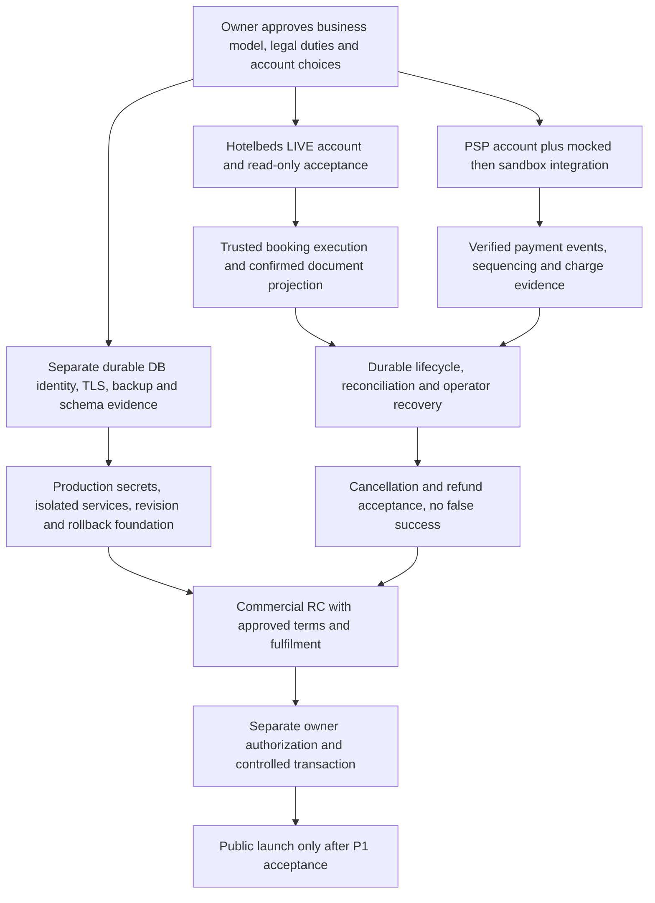

# Sprint 7A — Commercial / Production Readiness Gap Audit

Audit date: 2026-10-04, Asia/Qyzylorda. Documentation/planning only.

## 1. Executive summary

SPRINT 7A — AUDIT: PASS — repository evidence scope. COMMERCIAL PRODUCTION READINESS: **NOT READY**. Consumer RC and Booking Lifecycle RC: **READY — tested non-commercial scope**. Commercial launch has **10 P0 blockers**, **6 P1 requirements**, **4 P2 improvements** below. Counts describe work packages, not scores or certification.

The gap is not merely buying infrastructure and setting flags. productionGateService hardcodes sales, real charges and refunds false; booking/payment intents deliberately stop without execution. Real PSP integration and durable cross-domain orchestration remain unfinished. Existing templates/preflight check a safe TEST/disabled foundation, not an activated commercial deployment. Keep all current guards unchanged until separately authorized implementation and acceptance.

## 2. Current RC baseline

Started on develop, clean tracked tree, HEAD `b0a7515 docs: record Sprint 6N booking lifecycle RC`. Unrelated untracked owner files preserved. 6N committed. Historical 6N: RC 40/40, adjacent 256/256, full backend 714/728 with 14 known DB-blocked, zero non-commercial RC blockers; no new tests here. 5K final owner acceptance supports consumer RC; current owner evidence supports Search → Details → Hotelbeds TEST CheckRate → confirmed 2075.98 EUR → travellers → Review → BOOKING_DISABLED. Booking/payment providers were not called. Historical acceptance is attributed to the owner, not a new independent remote verification.

TEST retained; LIVE, real booking/payment/charges/cancellation/refunds/email/sales remain off. Production infrastructure paused. No runtime/config/schema/dependency changes, DB access, provider/Render calls, provisioning, deployment, secret generation, git add/commit/push. Full tests/lint/build NOT RUN. No actual .env, credential, certificate, backup or database contents manually inspected.

## 3. Readiness matrix

READY is repository/tested scope only. BLOCKED means a named commercial prerequisite is unmet; external status is not inferred from code. READY WITH OWNER ACTION requires evidence/configuration rather than a completed remote action.

| Area | Current state | Evidence | Gap | Priority | Next action | Owner |
| --- | --- | --- | --- | --- | --- | --- |
| Consumer UI | READY | 5K final acceptance; 5H/5I | Public commercial copy/device checks | P1-03 | Accept final commercial journey | Owner/Engineering |
| Auth | READY — tested scope | 3Z; 5K authenticated routes | Production origin/secret/session threat review | P0-08/P1-02 | Review deployed trust/session boundary | Engineering/Owner |
| Search | READY TEST; BLOCKED LIVE | 3D; 6N | LIVE inventory/access/quota evidence | P0-02 | Owner-confirm access, authorize bounded validation | Owner/Hotelbeds |
| CheckRate | READY TEST; BLOCKED LIVE | 6N; owner 2075.98 EUR | LIVE confirmed offer/currency/conditions evidence | P0-02 | Accept LIVE read-only flow separately | Owner/Engineering |
| Traveller flow | READY | 6N real normalization | Commercial PII retention/access decision | P0-10/P1-02 | Approve data handling and acceptance | Owner/Engineering |
| Review | READY disabled scope | 6N; hotelbedsBookingService.reviewPreview | Commercial cancellation terms/consent and execution | P0-03/P0-10 | Bind approved terms and trusted review to transaction | Engineering/Owner |
| Booking architecture | BLOCKED for real sales | intentBoundary; provider controller | Execution path, gates and commercial persistence acceptance | P0-03 | Implement separately authorized commercial path | Engineering |
| Payment architecture | BLOCKED | paymentGatewayService; 6J | Real PSP/webhook/auth-capture orchestration | P0-05 | Mock first; integrate chosen PSP later | Engineering |
| Recovery | BLOCKED commercially | bookingPaymentRecovery; 6M/6N | Policy is not durable execution/operational reconciliation | P0-07 | Durable outcomes, reconciler and action ownership | Engineering/Operations |
| Cancellation | BLOCKED | 6N; 6M report | Intent unavailable; real cancellation acceptance missing | P0-06 | Integrate evidenced cancellation with unknown handling | Engineering/Owner |
| Refund | BLOCKED | paymentGatewayService.prepareRefundIntent; 6L contract via 6M/6N | Readiness only; no real PSP refund | P0-06 | Integrate refund against actual charge/penalty | Engineering/PSP |
| Lifecycle | READY validator; BLOCKED durable commerce | bookingLifecycle; 6M/6N | Not wired to every mutation/history projection | P0-07 | Enforce transitions at durable boundaries | Engineering |
| Database | BLOCKED | 4C.1; databaseConfig; infrastructure manifest | Separate persistent production target not evidenced | P0-01 | Owner approves/provisions; verify identity/TLS/schema | Owner/Engineering |
| Hotelbeds LIVE | BLOCKED; approval UNKNOWN / NEEDS EVIDENCE | 3D; config/hotelbeds | Credentials/mTLS/read acceptance; approval status unknown | P0-02 | Privately confirm account permissions and requirements | Owner/Hotelbeds |
| Payment provider | BLOCKED | 6J; gateway only disabled/sandbox | No activated merchant account/integration evidence | P0-04 | Choose PSP and confirm merchant/account capabilities | Owner/PSP |
| Email | NOT REQUIRED FOR LAUNCH with accepted manual fulfilment | emailProviderService; voucherService | Email off; real delivery not tested | P1-04 | Approve delivery fallback, then configure/test email | Owner/Engineering |
| Infrastructure | BLOCKED | 4A/4B; production manifest/templates | No production deploy/domain/TLS/browser acceptance evidence | P0-08 | Owner-authorized isolated deployment after gates | Owner/Engineering |
| Observability | READY code; BLOCKED transaction operations | health routes; reliabilityMonitor; adminOperations | External alerts/on-call and reconciliation evidence absent | P0-07/P1-01 | Assign ops owner; validate alerts and queue | Operations/Engineering |
| Backups | READY tooling; BLOCKED production DR | 3Y latest local-copy restore; continuity runbook | Target-specific backup destination/drill/cutover absent | P0-09 | Approve objectives, isolated drill and recovery plan | Owner/Operations |
| Security | UNKNOWN / NEEDS EVIDENCE beyond baseline | 3Z; middleware; 6N trust tests | No production security/PSP review or certification | P1-02/P0-05 | Review auth, webhooks, secrets, frontend headers | Engineering/Owner |
| Legal/Trust | BLOCKED for commercial documents; OWNER ACTION | helpContent; 5J; site config | Informational TEST copy explicitly not approved policies | P0-10 | Owner/legal approves identity, terms/privacy/disclosures | Owner/Legal |
| Operations | BLOCKED commercially | adminOperations; provider controller; 6M limits | Inspection/manual provider sync exists, commercial runbook unproven | P0-07 | Test uncertain outcomes and assign case handling | Operations/Engineering |

## 4. P0 launch blockers

Each item must close before real sales. No approval, account, payment or legal obligation is asserted completed. Costs are owner decisions; no current pricing researched.

| ID / Area | Blocker and why it blocks launch | Exact evidence | Dependency | Cost/account/approval | Concrete next action / closure evidence |
| --- | --- | --- | --- | --- | --- |
| P0-01 Database | No evidenced separate durable production PostgreSQL/schema; cannot reliably persist financial/booking outcomes | 4C.1 final NOT YET ATTESTED / migration NOT RUN; production.infrastructure.json | Owner + Engineering | Infrastructure plan/cost approval required; paid tier choice not assumed | Resume existing provisioning runbook only when authorized; private identity/distinctness attestation, approved inspection, ledger/migration/TLS and connection evidence |
| P0-02 Hotelbeds LIVE | No LIVE acceptance; TEST offer is not commercial inventory authority | 3D LIVE NETWORK BLOCKED; config/hotelbeds separate LIVE key/secret/mTLS names | Owner + Hotelbeds + Engineering | Account/access approval; commercial terms/quota and any certification requirements UNKNOWN | Owner obtains actual account requirements/access evidence; privately configures LIVE material; separately authorizes bounded status/Availability/CheckRate acceptance; no booking yet |
| P0-03 Booking execution | Current intent always BOOKING_DISABLED; LIVE transport also checks hard false sales gate; env flag alone cannot create valid commercial bookings | hotelbedsBookingService.intentBoundary/assertBookingAllowed; client.assertLiveMutationAllowed; productionGateService | Engineering + Owner | Separate activation approval; provider account depends on P0-02; no extra service assumed | Design authorized review-to-durable-attempt execution; preserve guards until isolated acceptance of duplicates, confirmed/unknown outcomes and trusted history/voucher states |
| P0-04 Merchant provider | No activated real PSP/account evidence, so no accepted commercial money path | 6J report; paymentGatewayService.readiness/createIntent | Owner + PSP | Merchant account, terms/account approval and fees require owner decision | Choose PSP, verify supported currencies/auth-capture/refunds/webhooks and account availability; obtain private production credentials later |
| P0-05 Real payment integration | Disabled/sandbox path is not real charge; no real PSP webhook/auth-capture workflow established in inspected payment routes/service | gateway readiness configured=false outside disabled/sandbox; 6J rejects card inputs; no webhook match in inspected routes | Engineering + PSP | P0-04 account; approval for real-money testing; no new paid service needed for mocks | Hosted/tokenized PSP flow, verified replay-safe webhook intake, trusted money, durable event dedupe, charge reconciliation and explicit booking-payment sequencing; sandbox then authorized production acceptance |
| P0-06 Cancellation/refund execution | Unavailable intents and policy-only compensation cannot handle actual failed/cancelled commercial obligations | 6M/6N; prepareCancellationIntent/prepareRefundIntent delegates; hard refund gate | Engineering + Owner/provider | Provider/PSP accounts; separate financial-operation authorization | Implement rate/penalty-bound cancellation, real-charge refund, duplicate and lost-response handling; test partial failure without fabricated completion |
| P0-07 Durable recovery/operations | Pure policies/validator cannot ensure transaction convergence after crash/unknown or truth in history | 6M limitations; bookingPaymentRecovery plan attemptAllowed=false; provider controller manual reconciliation | Engineering + Operations | Named responsible operator required; external service purchase not inherently required | Persist attempts/events and evidence; enforce lifecycle transitions/history projection; bounded explicit reconciliation with operator escalation; rehearse unknown/partial failure/crash cases |
| P0-08 Production config/deploy | No production environment/resource/revision evidence; current templates certify disabled foundation only | 4A/4B; render.production.yaml; productionFoundationEnvSchema; infrastructure manifest | Owner + Engineering | Hosting/account/domain and secret-entry approval; costs to approve | Privately set isolated DB/URLs/CORS/secrets/TLS, approved migration/revisions/rollback, backend health/readiness then frontend receipt/browser acceptance; design separate future commercial gate without weakening current safe gate |
| P0-09 Production recovery | Historical staging dump/local restore does not protect future production writes or prove production cutover | 3Y latest local-copy evidence; continuity runbook no upload/retention; foundation runbook production restore blocked | Owner + Operations | Backup destination/access/cost and loss/window approval | Record production-specific backup/restore evidence, off-machine protected copies/retention, restore/cutover authorization; define RPO/RTO with owner, not invented values |
| P0-10 Legal/fulfilment | Current pages explicitly not commercial contract/privacy policy; real customer terms/operator responsibility and usable confirmed fulfilment not accepted | helpContent booking/privacy/cancellation; 5J; voucherService TEST mapping | Owner + Legal + Engineering | Legal/company/contract review approval; cost unknown | Approve operator identity/contact, terms/privacy/data handling, rate cancellation/refund/currency/tax disclosures and consent; verify actual-booking document/manual delivery path before sales; remove TEST wording only with genuine approved mode |

## 5. P1 requirements

Six requirements before unrestricted public launch, potentially after a supervised first transaction only if P0 controls and explicit owner acceptance hold:

1. **P1-01 Monitoring:** establish external uptime/log retention/alert routing and tested booking/payment failure alerts; current health/request IDs/reliability code is not external coverage. Owner/Operations, account/cost choice unknown.
2. **P1-02 Security review:** review production auth/authorization, localStorage XSS tradeoff and token revocation limitations, secret rotation, PSP webhook replay/signatures, admin permissions, proxy/CORS and frontend security headers; fresh dependency advisory review. No online scan in 7A.
3. **P1-03 Public UX acceptance:** approve responsive production checkout/errors, 320/390/768/desktop, keyboard and selected real browser matrix; existing 5I evidence is limited, Safari/Firefox acceptance not claimed. No measured real-user performance baseline yet.
4. **P1-04 Notifications/documents:** accept confirmed-booking voucher, cancellation/refund notices and actual email delivery if chosen. Manual safe delivery can serve controlled launch only with owner/legal approval; email is not automatically mandatory. Never deliver local/sandbox confirmation as real fulfilment.
5. **P1-05 Capacity/provider limits:** confirm actual provider quota/content rights, catalog freshness/coverage required for selected markets, DB connection budget/timeouts and replica behavior. In-memory API limiter and client request queue are not contractual quota or multi-instance capacity evidence. Restrict launch markets/rates until accepted.
6. **P1-06 Operational launch rehearsal:** public support contacts/staff, incident escalation, booking/payment unknown handling, cancellations/refunds, PSP dispute intake appropriate to selected PSP, deploy order/rollback and approved launch stop criteria. Existing runbooks are a base, not a production drill.

## 6. P2 improvements

Four post-launch improvements, never a reason to defer unresolved P0/P1 safety:

1. **P2-01** Measured real-user performance and further bundle optimization; 5H splitting already accepted, historical build sizes are not today's measured performance.
2. **P2-02** Broader cross-browser/assistive-device coverage beyond the accepted public-launch matrix.
3. **P2-03** Operator case automation, richer reconciliation dashboards and reporting beyond minimum auditable recovery.
4. **P2-04** Advanced dispute/chargeback analytics and operational forecasting; basic PSP-required dispute handling belongs to P1-06/P0-04 decisions, not deferred compliance.

## 7. Hotelbeds LIVE gap

3D proves read-only code preparation, not successful LIVE networking. Separate LIVE credentials and mTLS configuration exist in backend/config/hotelbeds.js; TEST does not automatically become LIVE. Booking/cancellation transport requires enabled booking/LIVE mutation permission and production sales gate. Read retries are bounded and request pacing exists; actual commercial limits are unknown. Existing content/catalog preparation and TEST coverage cannot certify LIVE market coverage/freshness.

LIVE approval/certification status: **UNKNOWN / NEEDS OWNER/EXTERNAL EVIDENCE**. No repository evidence establishes a particular mandatory certification checklist, fee or approval timeline. Owner must ask the provider what the actual account permits and supply non-secret acceptance evidence. Do not buy infrastructure or change flags solely to make offline gates pass.

## 8. Booking activation gap

Signed offers, confirmed price, valid guests, server Review, TEST adapter, claimed attempts and unknown reconciliation exist. 6M hardened provider-reference confirmation truth; 6N validates safe integration. But current Review intent never executes; consumer intent and legacy provider execution are not a commercially accepted transaction chain. Existing claim/status handling is not proof of full distributed crash/idempotency safety. My Bookings and voucher currently expose stored facts/TEST semantics; 6M explicitly notes new lifecycle summary is not wired across every historical mutation/read model.

Before HOTELBEDS_BOOKING_ENABLED=true: close provider/account access, durable transaction/recovery, payment sequencing, legal rate acceptance, real document/status projection and isolated activation tests. A future gated implementation must retain current disabled defaults. Setting that flag alone is neither sufficient nor authorized.

## 9. Payment gap

6J supplies trusted amount/currency and rejects card/client state fields. Gateway supports disabled/sandbox only; no established real PSP integration in inspected routes/service. Choose hosted/tokenized collection so raw cards never enter Asedeliya storage/logs. Merchant account, API/webhook secrets and real operation capabilities need owner/PSP evidence. Authorization-versus-capture order, 3DS/redirect outcomes if applicable, verified events, dedupe, unknown reconciliation, refunds and disputes depend on the chosen PSP and booking model; no vendor-specific requirement invented.

No PCI compliance claim. Existing no-card boundary is useful scope reduction, not certification. First engineering step can use mock PSP events with no merchant account and all real-money gates off.

## 10. Database/infrastructure gap

4C.1 prepared provisioning/distinctness tooling but recorded no created/attested production database. Production infrastructure manifest is DRY_RUN. Templates specify separate names/main, auto deploy off and safe TEST defaults; they do not provision the database or prove actual services/domains/HTTPS. Main/release promotion policy also needs owner review.

Runtime databaseConfig supports verified TLS with optional CA, rejects ambiguous SSL overrides, 5s connection timeout; pool capacity remains pg default unless separately reviewed, not validated against a future service budget. Existing migrations are explicit/advisory-locked/per-file transactional, not automatic startup; earlier commits survive later failure and no reverse migration set exists (4A/runbook). Verify actual production schema, isolation, TLS and backup prerequisites before separately authorized execution. Staging remains untouched.

ENV contract inventory below reports names/contracts only; actual deployed values and secret presence **UNKNOWN**. OWNER MUST SET after authorization; never paste secret contents into evidence.

| Contract names | Contract status | Deployment responsibility/evidence |
| --- | --- | --- |
| DATABASE_URL; JWT_SECRET; OFFER_TOKEN_SECRET | PRESENT CONTRACT | OWNER MUST SET private production values; not inspected |
| HOTELBEDS_LIVE_API_KEY / LIVE_API_SECRET; LIVE_MTLS_CERT_PATH / KEY_PATH / KEY_PASSPHRASE / CA_PATH | PRESENT CONTRACT | OWNER MUST SET required LIVE material; optional passphrase/CA depend on account; values UNKNOWN |
| PSP API credentials / webhook signing secret | MISSING CONTRACT for a chosen real PSP | OWNER MUST SET later; Engineering defines vendor-specific contract after selection |
| EMAIL_PROVIDER; EMAIL_ENABLED; RESEND_API_KEY; EMAIL_FROM | PRESENT CONTRACT | OWNER MUST SET if delivery chosen; actual availability UNKNOWN |
| CORS_ORIGINS; VITE_API_URL; production/staging API/origin labels; RELEASE_SHA / EXPECTED_RELEASE_SHA | PRESENT CONTRACT | OWNER MUST SET/review actual target/build provenance; public frontend never receives server secrets |
| DB_SSL_MODE / DB_SSL_CA_PATH; safety flags; rollback/backup/target attestations | PRESENT CONTRACT | OWNER MUST SET justified policy/evidence; attestation is not remote verification |

## 11. Observability/operations gap

/health performs bounded DB SELECT; /api/health/live is liveness and /ready tests database plus shutdown state. These endpoints do not certify provider/PSP availability. Request telemetry/security middleware, redacted logs, CheckRate diagnostics, internal reliability incidents and admin inspection/acknowledgement exist. adminOperations enforces auth/admin role/permission. Existing provider controller can reconcile uncertain stored bookings; this is not a durable commercial queue with assigned operators and PSP reconciliation.

External uptime/alert destinations, log retention, on-call/support availability and production incident acceptance remain UNKNOWN. Minimum audited uncertain-outcome ownership is P0-07; broader alerts/rehearsal P1-01/06. Legacy schedulers/monitors are not activated by this audit.

## 12. Security gap

Repository baseline: JWT/bcrypt/user-scoped authorization (3Z evidence), signed offer and money tamper checks (6N), safe public errors, logger redaction, API/auth memory rate limiting, CORS allowlist and API security headers. HSTS depends on production HTTPS/proxy context. Static frontend has a separate serving boundary; API CSP alone is not frontend CSP evidence. No current dependency vulnerability certification/penetration test or automated CI security workflow evidenced (.github absent in this checkout).

3Z records localStorage bearer storage and no server token revocation on logout/password change. Assess risk/expiry/revocation in the commercial threat model rather than declaring the baseline secure. PII retention/access/backup controls and webhook/merchant risk need review. Security: **PARTIAL**, not SECURITY CERTIFIED.

## 13. Legal/commercial gap

5J and helpContent explicitly describe informational TEST pages, not approved legal terms/privacy policy; cancellation/refund availability and timelines are not promised. Canonical phone/email/city exist in site config, not evidence of verified legal operator identity or staffed support. Pricing/currency UX is prepared but actual rate inclusions, fees/taxes, customer acceptance and commercial disclosures need owner/legal review. Do not assume a jurisdictional rule or provider contract obligation from placeholders.

P0-10 requires approved content/responsibility and fulfilment. TEST disclaimers remain truthful now and must not be removed before actual commercial authorization. Email sending has Resend/console adapters, disabled now; voucherService treats Hotelbeds as TEST. Real document readiness is not established just because a template renders. Controlled manual fulfilment is a proposed option for owner/legal approval, not a completed launch capability.

## 14. Owner/external actions

- Owner approves costs/timing and selects distinct durable DB/hosting plans/domain; follows existing DB attestation process without relinking staging.
- Owner privately supplies production secrets/targets, authorizes inspection/migrations/deploy and approves fallback/recovery objectives and backup destination.
- Hotelbeds/owner confirms actual LIVE account, credentials/mTLS, allowed operations, quota/content/commercial terms and any required approval/certification; status currently UNKNOWN.
- Owner/PSP selects merchant provider, confirms account/currencies/auth-capture/refund/dispute capabilities and later supplies private API/webhook secrets.
- Owner/legal supplies operator identity and approved terms/privacy/cancellation/refund/pricing/data-handling policies; appoints support and reconciliation owners and accepts fulfilment channel.
- Owner gives separate approval for commercial code changes, live read checks, real booking/money acceptance and controlled launch. Nothing here grants it.

## 15. Work possible without paid services

**YES.** Can be completed now without paid production services: mock PSP interface/events and replay-safe webhook contract; trusted-money/event dedupe tests; design crash-safe booking/payment attempt persistence and lifecycle projection using local synthetic fixtures; recovery/operator case contracts; truthful voucher and notification mocks; production activation acceptance checklist distinct from current safe foundation gates; secret-name/rotation policy, dependency review plan, backup/alert destination contracts and incident drills with fixtures. Existing validators/runbooks should be reused, not duplicated.

These are future scoped tasks; no implementation in 7A. Real target TLS/schema/restore, LIVE access and actual PSP acceptance remain external evidence work even if mocks pass. Keep production DB paused, LIVE/payment provider unavailable and all sales gates off.

## 16. Activation dependency graph

Engineering/mocks can run before paid provisioning; real acceptance depends on actual target/accounts. This graph is a plan, not instructions to enable current hard gates or execute operations. Existing 4B order remains applicable for foundation deployment: DB/attestation → separately authorized migration → backend → health/readiness → bound frontend build/preflight → owner browser acceptance, with sales still off.

## 17. Recommended Sprint 7B

**Payment Provider Contract & Mock Webhook Foundation.** Define a vendor-neutral hosted-payment adapter seam and immutable trusted server amount/currency/event identifiers; mocked signed-event verification/replay/deduplication and pending/unknown/refund event transitions. Do not select contractual merchant settings automatically, collect cards, connect a PSP, enable charges, remove productionGate, migrate a real DB or provision services. Deliver testable contracts and document selected-PSP decisions still needed. Then plan durable cross-domain reconciliation as a separate implementation sprint.

## 18. Exact evidence/files inspected

Read-only full or targeted excerpt/source searches, not repository re-audit:

- Reports: SPRINT_6N_BOOKING_LIFECYCLE_RELEASE_CANDIDATE_REPORT.md; SPRINT_6J_PAYMENT_ARCHITECTURE_FOUNDATION_REPORT.md; SPRINT_3D_HOTELBEDS_LIVE_READONLY_REPORT.md; SPRINT_3Y_DATABASE_CONTINUITY_BACKUP_RESTORE_REPORT.md; SPRINT_3Z_PREPRODUCTION_HARDENING_REPORT.md; SPRINT_4A_PRODUCTION_FOUNDATION_REPORT.md; SPRINT_4B_PRODUCTION_INFRASTRUCTURE_READINESS_REPORT.md; SPRINT_4C1_PRODUCTION_DATABASE_PROVISIONING_REPORT.md; SPRINT_5K_CONSUMER_RELEASE_CANDIDATE_REPORT.md; SPRINT_5H_PERFORMANCE_BUNDLE_LOADING_REPORT.md; SPRINT_5I_ACCESSIBILITY_CROSS_BROWSER_QUALITY_REPORT.md; SPRINT_5J_TRUST_HELP_LEGAL_POLISH_REPORT.md.
- Release/infrastructure: render.yaml; render.production.yaml; production.infrastructure.json; STAGING_DEPLOY_RUNBOOK.md; PRODUCTION_FOUNDATION_RUNBOOK.md; DATABASE_CONTINUITY_RUNBOOK.md; backend/scripts/productionFoundationEnvSchema.cjs; backend/scripts/sprint6aReleaseGate.cjs; backend/scripts/sprint3mVerify.cjs; backend/scripts/lib/dbContinuity.cjs. Existing 6B/6C/6D and DB CLI filenames inventoried, not executed.
- Backend: backend/config/providers.js; backend/config/hotelbeds.js; backend/config/database.js; backend/db.js (source only); backend/server.js; backend/routes/health.js; backend/routes/stagingHealth.js; backend/routes/adminOperations.js; backend/middleware/rateLimit.js; backend/middleware/securityHeaders.js; backend/services/productionGateService.js; backend/services/paymentGatewayService.js; backend/services/hotelbedsBookingService.js; backend/services/bookingPaymentRecovery.js; backend/services/bookingLifecycle.js (existing 6M evidence reused); backend/services/emailProviderService.js; backend/services/voucherService.js; backend/services/reliabilityMonitorService.js; backend/services/backupSchedulerService.js; backend/controllers/providerBookingController.js. Focused searches in payment routes/controller/migrations for webhook/dispute contracts; no matches establish absence only in inspected scope.
- Frontend metadata/content: frontend/src/config/site.js; frontend/src/content/helpContent.js; package manifests and route/help filenames only. Consumer pages not re-audited. No .env/dump/certificate secret contents manually read; required verifier internally compares configured known secret strings without printing them.

Verification: **6A PASS**; **verifier PASS**, 229 backend syntax files, 501 secret-scan files, findings empty; **final diff-check PASS**. Each required check run once, in the requested order. No full tests/lint/build or 6B run. Exact new files: this report and PRODUCTION_LAUNCH_GAP_CHECKLIST.md. Existing files modified: none.

## 19. Limitations

Source and historical evidence audit only. No Render/DB/provider/PSP/merchant/legal lookup, online security scan, pricing lookup or remote resource attestation. Account approval, deployed secret presence, actual production resources and jurisdictional obligations remain unknown where not supported. Historical tests are not current reruns; 14 DB-blocked cases remain honest limitations. Audit PASS means useful documented gaps, **not PRODUCTION READY, PCI COMPLIANT, LEGAL COMPLIANT, SECURITY CERTIFIED or HOTELBEDS LIVE APPROVED**.

Frontend/backend runtime changed: NO. DB/schema changed: NO. External/provider calls and real DB mutations: 0. Everything left unstaged; no commercial activation authorized.
